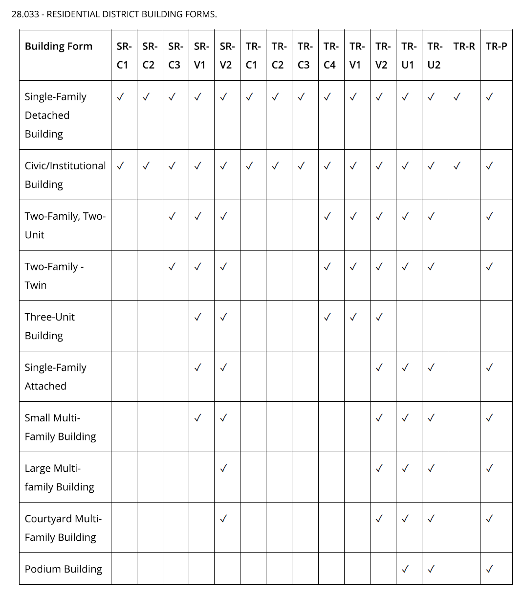

```{r setup, include=FALSE}
knitr::opts_chunk$set(echo = TRUE)
```

# Background
The *New York Times* recently published an analaysis of how much land in several US cities only allows the construction of detached single-family houses. 
<https://www.nytimes.com/interactive/2019/06/18/upshot/cities-across-america-question-single-family-zoning.html>

The cities analyzed were

City                  Proportion detached single-family to all housing
--------              ----------------------
New York              15%
Washington            36%
Minneapolis           70%
Los Angeles           75%
Portland (OR)         77%
Seattle               81%
Charlotte (NC)        84%
Sandy Springs (GA)    85%
Arlington (TX)        89%
San Jose (CA)         94%

I immediately wondered how my current hometown, Madison (WI), would compare.


# Data sources
* Madison zoning data is available from the city's Open Data portal: <https://data-cityofmadison.opendata.arcgis.com/datasets/zoning-districts>
    + licensed under the [City of Madison Data Policy}(https://www.cityofmadison.com/policy/data)
    + already contains the area for each polygon
* The meaning of each zoning district is documented in MuniCode, specifically [28.032](https://library.municode.com/wi/madison/codes/code_of_ordinances?nodeId=COORMAWIVOIICH20--31_CH28ZOCOOR_SUBCHAPTER_28CREDI_28.032REDIUS) and [28.033](https://library.municode.com/wi/madison/codes/code_of_ordinances?nodeId=COORMAWIVOIICH20--31_CH28ZOCOOR_SUBCHAPTER_28CREDI_28.033REDIBUFO)


# Analysis

I'll work with [R](https://www.r-project.org/)'s `tidyverse` package.

```{r, results = 'hide'}
library(tidyverse)
```

Load the data with the `read_csv` function.

```{r}
data <- read_csv(
  "https://opendata.arcgis.com/datasets/4bfd0deffa8f4d5f8eefe868ab91493c_9.csv",
  col_types = "iccccccdd")
```


## Determine what counts as residential
The *New York Times* analysis focused exclusively on residential districts, leaving out commercial or mixed use districts: "These maps highlight the land exclusively set aside for housing."
Ordinance 28.032 defines the following as residential districts:
SR-C1, SR-C2, SR-C3, SR-V1, SR-V2, TR-C1, TR-C2, TR-C3, TR-C4, TR-V1, TR-V2, TR-U1, TR-U2, TR-R, TR-P

I will therefore excldue all other Madison zoning codes from the analysis. 

```{r}
#create variables for residential zoning and single-family zoning codes
res_zones <- c("SR-C1", 
                 "SR-C2", 
                 "SR-C3", 
                 "SR-V1",
                 "SR-V2",
                 "TR-C1",
                 "TR-C2", 
                 "TR-C3",
                 "TR-C4",
                 "TR-V1",
                 "TR-V2", 
                 "TR-U1", 
                 "TR-U2", 
                 "TR-R",
                 "TR-P")


```


## Determine what counts as "zoned for detached single-family homes"
The *Times* focuses on "codes devoted to detached single-family homes, grouping rowhouses more common in older East Coast cities like Washington and New York into a second category covering all other housing types."

Ordinance 28.033 lists the following building forms:



Determining what falls under detached single-family homes appears straightforward:  SR-C1, SR-C2, TR-C1, TR-C2, TR-C3, TR-R.

```{r}
sfr_zones <- c("SR-C1", 
         "SR-C2",
         "TR-C1", 
         "TR-C2", 
         "TR-C3", 
         "TR-R")
```


Now all that remains is to sum up the areas for all single-family detached and divide by the total residential area.

```{r}
res_total <- data %>%
  filter(ZONING_CODE %in% res_zones) %>%
  summarize(sum(ShapeSTArea))

res_sfr <- data %>%
  filter(ZONING_CODE %in% sfr_zones) %>%
  summarize(sum(ShapeSTArea))

SFR_ratio <- round((res_sfr/res_total)*100, digits = 0)
```
# Results
So pretty much exactly `r SFR_ratio` percent of all residentially zoned land in Madison allows only detached single-family housing. When I had first read the NYT article, my guess was Madison would be between somewhere 75 and 85 percent. I'm happy to see that the actual number is at the lower bounds of my guess, and fairly good compared to the cities mentioned in the original article:

City                  Proportion single-family detached to all housing
--------              ----------------------
New York              15%
Washington            36%
Minneapolis           70%
**Madison (WI)**      **75%**
Los Angeles           75%
Portland (OR)         77%
Seattle               81%
Charlotte (NC)        84%
Sandy Springs (GA)    85%
Arlington (TX)        89%
San Jose (CA)         94%


But of course it also means that a huge proportion of our residential lands is off limits for even medium density development.

A map created in `QGIS`  and styled to look roughly similar to the NYT maps helps visualize this:


## Limitations
In [a Twitter thread](https://twitter.com/crschmidt/status/1141040313655549952), Christopher Schmidt pointed out that even cities that seemingly don't limit most parts of the city to single-family homes, requirements such as lot sizes or building setbacks effectively still make it impossible to build anything but single-family homes.


